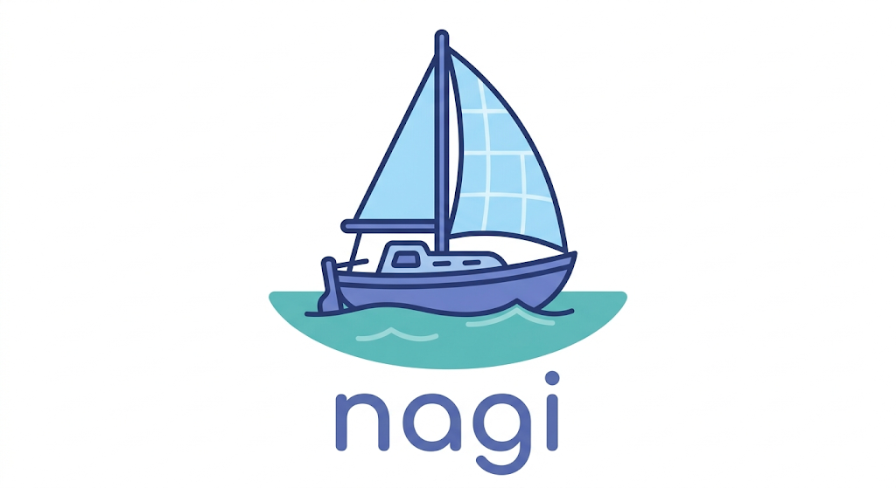

<p align="center">
  
</p>

<h1 align="center">Nagi (凪)</h1>

<p align="center">
  <em>面倒な作業やノイズを静かに消し去り、日常に波風の立たない「凪」のような平穏をもたらす。<br/>表立って主張するのではなく、裏で動いて平和を保ってくれる相棒。</em>
</p>

AI assistant that runs Claude Agent SDK in Docker containers and communicates through messaging channels (Slack, Discord, etc.).

Built as a clean-room reimplementation of [NanoClaw](https://github.com/qwibitai/nanoclaw) with a Turborepo monorepo architecture, plugin system, and DI-based design.

## Quick Start

Open [Claude Code](https://claude.ai/code) in this directory and run:

```
/setup
```

## CLI

Run agents from the terminal without opening Slack:

```bash
pnpm nagi "今日の天気を教えて"
pnpm nagi --list
```

## Dashboard UI

Web-based dashboard for monitoring and reviewing agent activity:

```bash
pnpm ui:dev    # Start SPA (port 5174) + API server (port 3001)
```

- **Overview** — Stat cards for Groups, Channels, Tasks, Sessions, and Logs
- **Groups / Channels** — Registered groups and channel connection status
- **Sessions** — Browse agent conversation logs in a chat UI with expandable thinking and tool use timelines
- **Tasks** — Scheduled task list
- **Logs** — Container and task execution logs with type filter
- **Settings** — Dark / light theme toggle

Tech: React 19 + Tailwind CSS 4 + Vite + Hono

## Architecture

See [docs/architecture.md](docs/architecture.md)

## Troubleshooting

Just ask Claude Code. It understands the codebase and skills, and can fix most issues for you.
