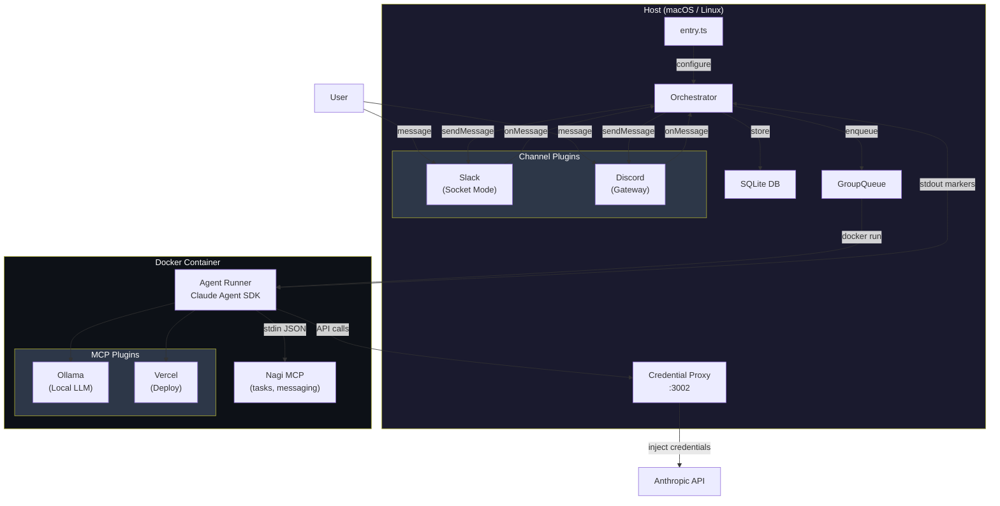
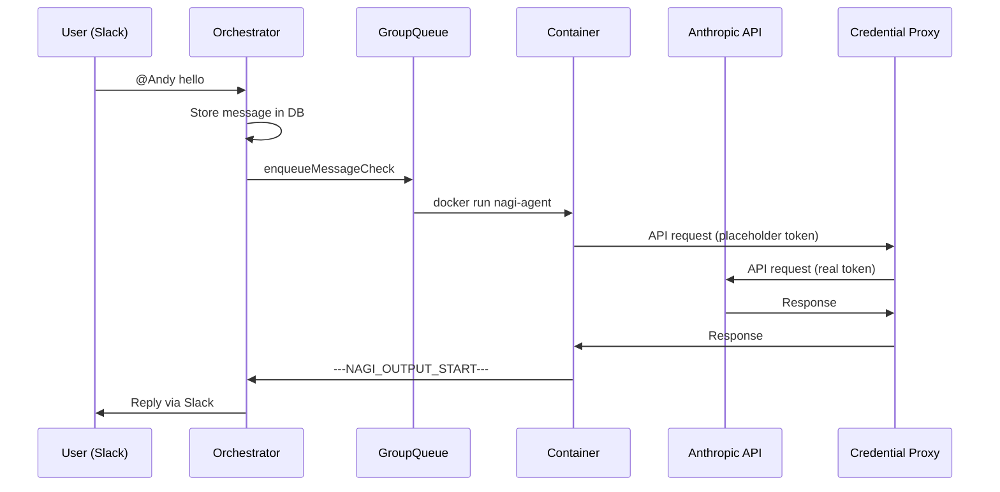

# Nagi

AI assistant that runs Claude Agent SDK in Docker containers and communicates through messaging channels (Slack, Discord, etc.).

## Architecture



### Message Flow



## Quick Start

```bash
# 1. Install
pnpm install && pnpm build

# 2. Configure
cp entry.template.ts entry.ts
cp .env.example .env
# Edit .env with your tokens

# 3. Build container
./container/build.sh

# 4. Run
pnpm dev
```

Or use `/setup` skill in Claude Code for interactive setup.

## Configuration

All configuration is in two files:

- **`.env`** — Tokens, assistant name, runtime settings
- **`entry.ts`** — Which plugins to enable (channels + MCP)

### Key .env variables

| Variable | Default | Description |
|---|---|---|
| `ASSISTANT_NAME` | Andy | Bot name and trigger pattern (`@Andy`) |
| `SLACK_BOT_TOKEN` | — | Slack bot token (`xoxb-...`) |
| `SLACK_APP_TOKEN` | — | Slack app token (`xapp-...`) |
| `DISCORD_BOT_TOKEN` | — | Discord bot token |
| `CLAUDE_CODE_OAUTH_TOKEN` | — | Claude subscription token |
| `ANTHROPIC_API_KEY` | — | Alternative: Anthropic API key |
| `VERCEL_API_TOKEN` | — | Vercel deployment token |
| `MAX_AGENT_TURNS` | 50 | Max turns per agent session |

## Skills

| Skill | Description |
|---|---|
| `/setup` | Initial setup wizard |
| `/add-channel-slack` | Configure Slack channel |
| `/add-mcp-vercel` | Enable Vercel deployment |
| `/add-mcp-ollama` | Enable local LLM |
| `/create-plugin-channel` | Scaffold new channel plugin |
| `/create-plugin-mcp` | Scaffold new MCP plugin |
| `/update-entry` | Sync entry.ts with template |
| `/update-groups` | Sync group templates |
| `/setup-launchd` | macOS background service |
| `/nagi-start` | Start service |
| `/nagi-stop` | Stop service |
| `/nagi-restart` | Restart service |
| `/nagi-logs` | View logs |

## Service Management (macOS)

```bash
# Install as launchd service
cp launchd/com.nagi.plist ~/Library/LaunchAgents/
launchctl load ~/Library/LaunchAgents/com.nagi.plist

# Restart after changes
launchctl kickstart -k gui/$(id -u)/com.nagi

# Logs
tail -f __data/logs/nagi.log
```

## Plugin System

### Channel Plugins (host-side)

```typescript
// entry.ts
registry.register("slack", createSlackFactory({ botToken: "..." }));
```

Use `/create-plugin-channel` to scaffold a new one.

### MCP Plugins (container-side)

```typescript
// entry.ts
orchestrator.registerMcpPlugin("ollama", {
  entryPoint: "/app/mcp-plugins/ollama/dist/index.js",
});
```

Use `/create-plugin-mcp` to scaffold a new one.

## Project Structure

```
nagi/
  entry.template.ts       ← Git-tracked template
  entry.ts                ← Local config (gitignored)
  .env                    ← Tokens & settings (gitignored)
  __data/                 ← Runtime data (gitignored)
    ├── store/            ← SQLite database
    ├── groups/           ← Per-group workspaces
    ├── sessions/         ← Claude sessions
    ├── ipc/              ← Container IPC
    └── logs/             ← Service logs
  groups/                 ← Group templates (git-tracked)
    └── main/CLAUDE.md    ← Agent behavior config
  container/
    ├── Dockerfile        ← Agent container image
    ├── build.sh          ← Build script
    └── skills/           ← Container-side skills
  apps/                   ← Application packages
  libs/                   ← Shared libraries
  plugins/                ← Channel & MCP plugins
```

## Development

```bash
pnpm build          # Build all packages
pnpm test           # Run all tests
pnpm dev            # Start orchestrator (foreground)
./container/build.sh  # Rebuild Docker image
```
