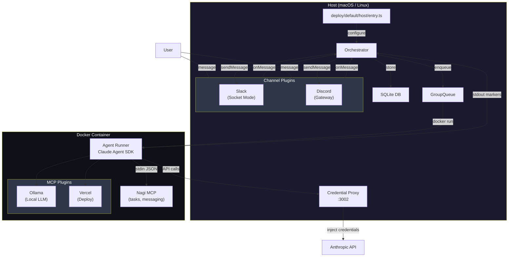
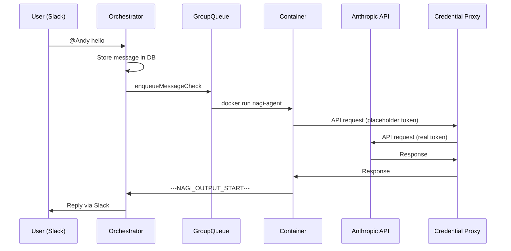
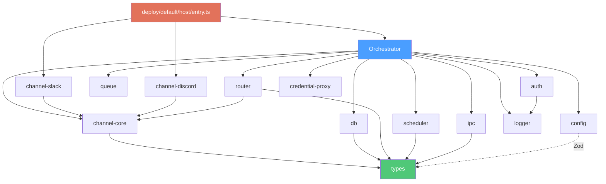

# Architecture

## System Overview



## Message Flow



## Package Dependencies



## Plugin System

### Channel Plugins (Host-side)

Channel plugins run on the host and connect to messaging platforms. They implement the `Channel` interface from `@nagi/channel-core`.

```
deploy/default/host/entry.ts → registry.register("slack", createSlackFactory({ ... }))
                             → Orchestrator connects all registered channels on start
```

### MCP Plugins (Container-side)

MCP plugins run inside Docker containers as stdio MCP servers. They provide tools to the Claude Agent SDK.

```
deploy/default/host/entry.ts → orchestrator.registerMcpPlugin("ollama", { entryPoint: "..." })
         → ContainerInput.mcpPlugins passed to agent-runner via stdin
         → agent-runner dynamically registers them as mcpServers
```

## Data Flow

| Directory | Purpose | Git |
|---|---|---|
| `deploy/templates/` | Entry point templates | Tracked |
| `deploy/default/` | Local entry points (generated) | Ignored |
| `groups/` | Group templates (CLAUDE.md) | Tracked |
| `__data/store/` | SQLite database | Ignored |
| `__data/groups/` | Runtime group data | Ignored |
| `__data/sessions/` | Claude sessions per group | Ignored |
| `__data/ipc/` | Container IPC files | Ignored |
| `__data/logs/` | Service logs | Ignored |
